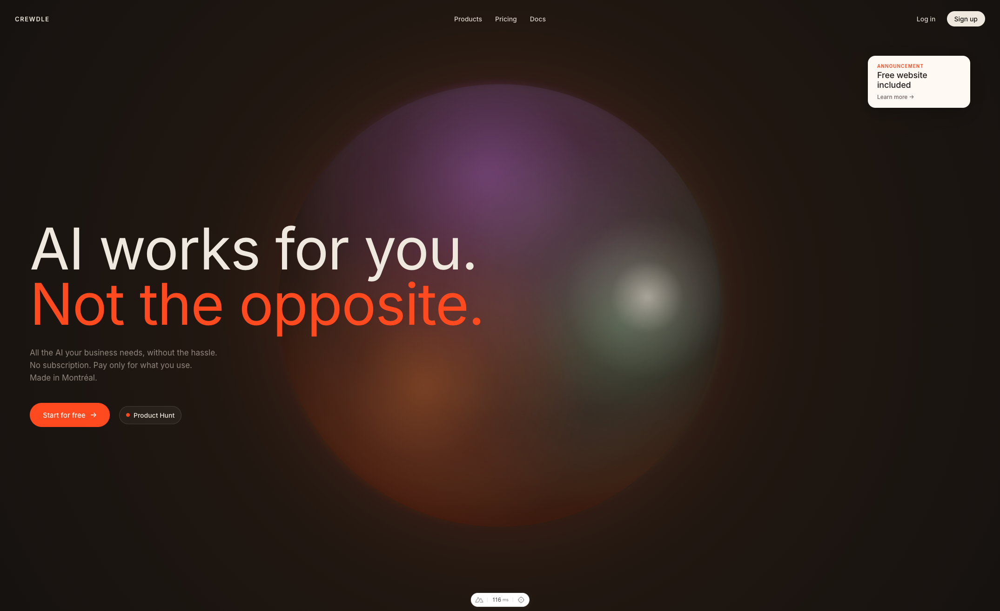
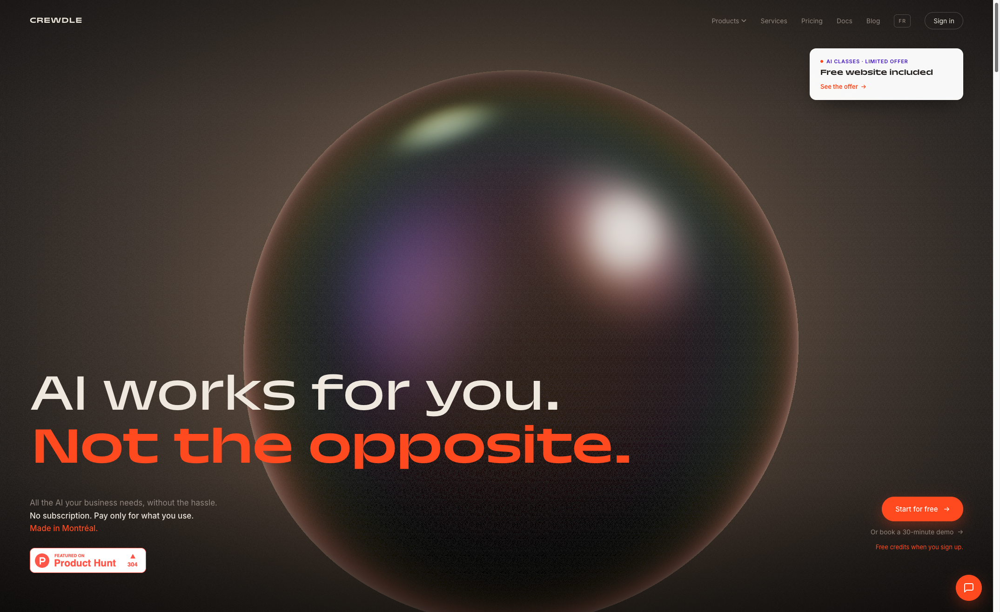

# demo-crewdle-banner

线上地址：https://lionad-morotar.github.io/demo-crewdle-banner/

Demo 项目，目标是复刻 [Crewdle.com](https://crewdle.com) 首页 Banner 的视觉效果。

## 工具栈

Token 消耗

| 指标 | 数值 |
| --- | --- |
| API 调用次数 | 715 |
| Input Tokens | 1,703,608 |
| Output Tokens | 304,997 |
| Cache Read Input Tokens | 88,179,778 |
| **合计** | **~90.2 M** |

## 效果

### Current Banner

### Target Banner

